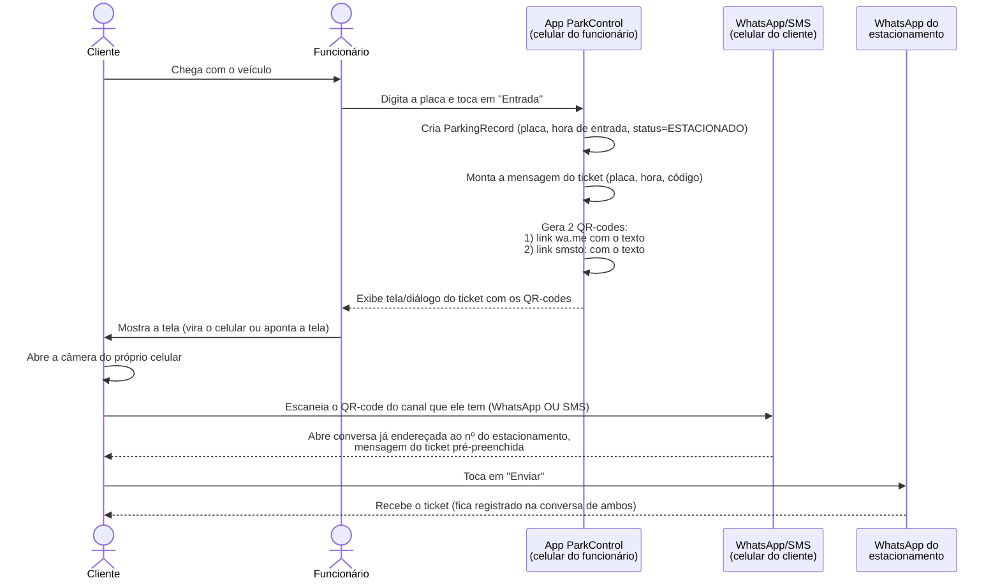

# Modelagem — Ticket Digital de Entrada (QR-code → WhatsApp/SMS)

> Documento de modelagem funcional. **Não representa código implementado**,
> apenas o desenho da solução (Opção A) para servir de base a uma
> implementação futura.

## 1. Contexto e problema

Hoje, quando um veículo entra no estacionamento, o funcionário registra a
placa e a hora de entrada no app. O cliente não recebe nenhum comprovante
físico ou digital desse registro.

**Objetivo:** dar ao cliente um "ticket digital" (equivalente ao ticket de
papel) sem:
- exigir que o cliente informe o telefone dele ao funcionário;
- exigir infraestrutura de backend/servidor (o app é local/offline);
- depender de o cliente ter o app ParkControl instalado.

## 2. Decisão de modelagem (Opção A)

O ticket é uma **mensagem de texto formatada** (placa, hora de entrada,
código do ticket), nunca uma imagem. O QR-code gerado pelo app carrega um
link de **"click to chat"**, que abre o app de mensagens do **próprio
cliente** (WhatsApp ou SMS) já com essa mensagem preenchida, endereçada ao
**número do estacionamento** (configurado uma única vez pelo dono, nas
configurações do app — não é o número do cliente).

Ou seja: quem envia a mensagem é o cliente, usando o número dele; quem
recebe é o estabelecimento. Isso elimina a necessidade de cadastrar o
telefone do cliente para este fluxo funcionar.

### Por que não uma imagem (ver conversa anterior)
- QR-code só comporta texto curto (não cabe uma imagem escaneável).
- Links de "click to chat" do WhatsApp (`wa.me`, `whatsapp://send`) só
  aceitam parâmetro de **texto**, nunca anexam mídia automaticamente.
- Anexar imagem exigiria hospedagem externa e passos manuais extras do
  cliente — fora do escopo desta modelagem (ver Opção C, não escolhida).

### Por que dois canais (WhatsApp e SMS)
Não é possível, apenas com o conteúdo de um QR-code, detectar se o celular
de quem está escaneando tem WhatsApp instalado e cair automaticamente para
SMS (essa decisão só seria possível com uma página web intermediária
hospedada, fora do escopo). Por isso o app oferece **dois QR-codes** (ou
duas opções na mesma tela) — o cliente escolhe o que ele tem instalado.

## 3. Atores

| Ator | Papel na jornada |
|---|---|
| **Funcionário** | Opera o app ParkControl no balcão/guarita. Registra entrada/saída. |
| **Cliente (dono do veículo)** | Chega com o carro, não usa o app, só escaneia o QR com a câmera do próprio celular. |
| **Dono do estacionamento** | Configura o número de WhatsApp/SMS do estabelecimento uma única vez. Recebe as mensagens dos clientes. |

## 4. Pré-requisito único: configuração do número do estacionamento

Antes de usar o recurso, o dono cadastra (uma vez, em *Configurações*) o
telefone (DDD + número) que vai receber os tickets via WhatsApp/SMS. Esse
número é o mesmo para todos os clientes — não há cadastro por cliente.

```
ParkingConfig
├── first30MinutesPrice
├── pricePerHour
├── toleranceMinutes
└── ownerWhatsAppPhone   ← novo campo (somente dígitos, ex.: "11999998888")
```

## 5. Jornada do usuário (fluxo principal)



### Passo a passo detalhado

1. **Entrada do veículo**
   - Funcionário digita a placa (e, opcionalmente, convênio/desconto) e
     toca em **Entrada**.
   - App cria o `ParkingRecord` (como já ocorre hoje), com `status =
     ESTACIONADO`.

2. **Geração do ticket digital**
   - App monta o texto do ticket, por exemplo:
     ```
     🎫 Ticket de Estacionamento
     Placa: ABC1D23
     Entrada: 29/08/2026 14:32
     Código do ticket: 8F3A21B0
     ```
   - App monta dois links a partir desse texto e do número do
     estacionamento (configurado):
     - WhatsApp: `https://wa.me/55<numero>?text=<mensagem>`
     - SMS: `smsto:<numero>?body=<mensagem>`
   - App gera um QR-code para cada link.

3. **Exibição ao cliente**
   - Tela/diálogo mostra os dois QR-codes lado a lado, com rótulos claros:
     *"Escanear com WhatsApp"* e *"Escanear com SMS (sem WhatsApp)"*.
   - Funcionário mostra a tela para o cliente (não precisa de impressora).

4. **Ação do cliente (fora do app ParkControl)**
   - Cliente abre a câmera nativa do próprio celular.
   - Escaneia o QR do canal que ele possui.
   - O SO do celular do cliente abre o WhatsApp (ou SMS) **dele**, com a
     conversa já endereçada ao estacionamento e a mensagem pronta.
   - Cliente confere e toca em **Enviar**.

5. **Resultado**
   - O cliente fica com uma cópia do ticket na própria conversa
     (comprovante pessoal, sem precisar guardar papel).
   - O dono/funcionário recebe a mensagem no WhatsApp/SMS do
     estacionamento — funciona como um registro adicional e canal de
     contato, mas **não é a fonte oficial do registro** (que continua
     sendo o `ParkingRecord` local do app).

6. **Saída do veículo (fluxo já existente, não alterado)**
   - Funcionário busca a placa (ou usa o código do ticket como referência
     rápida em caso de dúvida) e registra a saída normalmente.

## 6. Modelo de dados envolvido

Nenhuma nova entidade persistente é necessária além do campo de
configuração. O ticket em si é **derivado** do `ParkingRecord` já
existente — não é armazenado separadamente.

```
ParkingRecord (já existente)
├── id
├── licensePlate
├── entryTime
├── exitTime
├── status
└── ... (demais campos já existentes)

TicketMessage (conceito, não persistido)
├── derivado de ParkingRecord (placa, entryTime, id)
└── usado só para montar os links wa.me / smsto:
```

## 7. Casos de borda e decisões de design

| Caso | Comportamento modelado |
|---|---|
| Dono não configurou o telefone do estacionamento ainda | Tela do ticket mostra aviso e não gera os QR-codes (ou gera só a exibição em texto, sem link). |
| Cliente não quer escanear nada | Fluxo de entrada continua normalmente; o ticket digital é *opcional/complementar*, não bloqueia a operação. |
| Cliente já forneceu telefone no campo "Telefone" do registro | Esse telefone é apenas um dado de contato do cliente no sistema (já existente hoje); **não** é usado pelo QR-code, que sempre aponta para o número do estabelecimento. |
| Funcionário quer reexibir o ticket depois (ex.: cliente pediu de novo) | Botão "Ver Ticket" disponível enquanto o registro estiver com status `ESTACIONADO`. |
| Placa com múltiplas entradas ao longo do dia | Código do ticket (derivado do `id` do registro) diferencia cada entrada, evitando ambiguidade. |

## 8. Fora de escopo (explicitamente não modelado aqui)

- Envio de **imagem** do ticket (Opção C, requer hospedagem externa).
- Detecção automática de WhatsApp instalado com fallback para SMS
  (exigiria página web intermediária/backend).
- Leitura do QR-code pelo próprio app ParkControl na saída (poderia ser
  uma evolução futura, mas não faz parte desta modelagem).
- Envio de notificações push/automáticas para o cliente.

## 9. Resumo da decisão

| Critério | Opção A (modelada aqui) |
|---|---|
| Precisa do telefone do cliente? | Não |
| Precisa de servidor/backend? | Não |
| Conteúdo do ticket | Texto formatado |
| Passos do cliente | 1 escaneio + 1 toque em "Enviar" |
| Cobre quem não tem WhatsApp? | Sim, via QR-code alternativo de SMS |
| Ticket fica visualmente "bonito" (imagem)? | Não — é texto |

